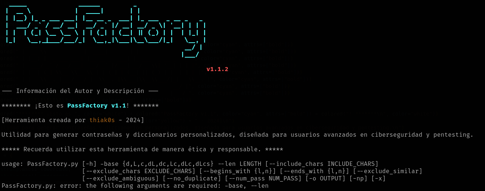

**README - PassFactory v1.1.2**

## PassFactory - Generador de Contraseñas Personalizadas



### Descripción

PassFactory es una herramienta diseñada para generar contraseñas y diccionarios personalizados. Esta utilidad está dirigida a usuarios avanzados en el campo de ciberseguridad y pentesting.

### Información del Autor

- **Herramienta creada por:** [thiak0s](https://github.com/thiak0s)
- **Versión:** 1.1
- **Año de Creación:** 2024

### Características Principales

- Generación de contraseñas personalizadas según especificaciones.
- Exclusión de caracteres similares y ambiguos para mejorar la seguridad.
- Opción para evitar caracteres duplicados en las contraseñas generadas.

### Uso Básico

#### Requisitos

- Python 3.x instalado en el sistema.

#### Ejecución

1. Abre una terminal o línea de comandos.
2. Navega hasta el directorio que contiene el script `passfactory.py`.
3. Ejecuta el script con el siguiente comando:

   ```bash
   python passfactory.py
   ```

#### Opciones de Configuración

- **-base:** Especifica el conjunto de caracteres a utilizar en la generación de contraseñas.
- **--len:** Establece la longitud deseada para las contraseñas.
- **--include_chars:** Permite agregar caracteres adicionales a la generación.
- **--exclude_chars:** Permite excluir caracteres específicos de la generación.
- **--begins_with:** Define si la contraseña debe empezar con letra (`l`) o número (`n`).
- **--ends_with:** Define si la contraseña debe terminar con letra (`l`) o número (`n`).
- **--exclude_similar:** Excluye caracteres visualmente similares.
- **--exclude_ambiguous:** Excluye caracteres ambiguos.
- **--no_duplicate:** Evita caracteres duplicados en las contraseñas generadas.
- **--num_pass:** Especifica el número de contraseñas a generar.

### Opciones Adicionales

- **-o, --output:** Directorio de salida para el archivo de contraseñas.
- **-np, --no_print:** No imprime las contraseñas en la pantalla.
- **-x, --exit_after_generation:** Sale directamente después de generar las contraseñas.

### Ejemplos de Uso

1. Generar 10 contraseñas con letras mayúsculas y minúsculas, dígitos y caracteres especiales, sin duplicados, con longitud 12:

   ```bash
   python passfactory.py -base dLcs --len 12 --num_pass 10 --no_duplicate
   ```

2. Generar una contraseña que comienza con un número y termina con una letra:

   ```bash
   python passfactory.py --begins_with n --ends_with l
   ```

3. Generar contraseñas que no incluyan caracteres similares ni ambiguos:

   ```bash
   python passfactory.py --exclude_similar --exclude_ambiguous
   ```

### Notas Importantes

- Recuerda utilizar esta herramienta de manera ética y responsable.

### Licencia

Este proyecto se distribuye bajo la licencia [MIT](LICENSE).

---

¡Espero que encuentres útil PassFactory para tus necesidades de generación de contraseñas y diccionarios personalizados! Si tienes preguntas, problemas o sugerencias, no dudes en [contactarme](https://github.com/thiak0s). ¡Gracias por utilizar PassFactory!
